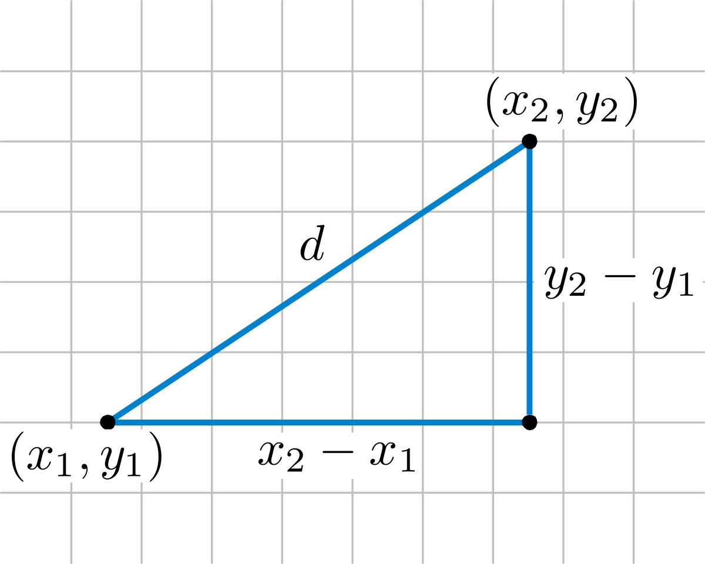
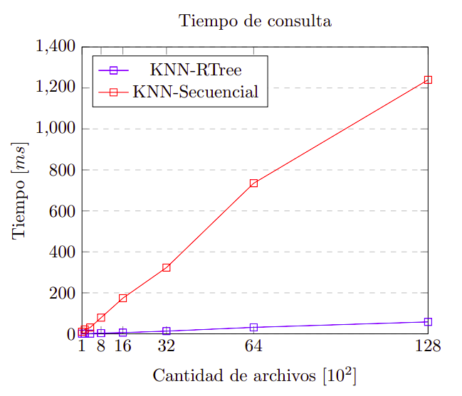

# Proyecto PC4 - Face Recognition

## Implementación Backend

### Implementación algoritmo KNN secuencial con cola de prioridad
Se ha implementado el algoritmo para la búsqueda KNN Secuencial, que recibe como parámetros la data, el query y el número k de resultados que se quiere obtener. Se ha usado la estructura de datos heap en la cola de prioridades para hacer el ordenamiento de los elementos de acuerdo a sus distancias. El código se muestra a continuación.

```
def knnSearchMD(data, Q, k):
    print("--- KnnSearchMD ---")
    resultado = []
    index = 0
    for row in data:
        distancia = MD(Q, row[1])
        heapq.heappush(resultado, (-distancia, index))
        if len(resultado) > k:
            heapq.heappop(resultado)
        index += 1
    resultado = [(i, -d) for d, i in resultado]
    resultado.sort(key=lambda tup: tup[1])
    return resultado
```

### Distancia Euclidiana
Para calcular la distancia euclidiana, se ha creado una función ```ED()``` a la que se le envían como argumentos dos arreglos (vectores característicos) y retorna su distancia euclidiana, como se muestra a continuación.

```
def ED(x, y):
    res = 0
    for i in range(len(x)):
        res += ((x[i] - y[i])**2)
    return res**0.5
```
Esta función está basada en el siguiente concepto de la distancia euclidiana.



### Distancia Manhattan
Para calcular la distancia de manhattan, se ha creado una función ```MD()``` a la que se le envían como argumentos dos arreglos (vectores característicos) y retorna su distancia de manhattan, como se muestra a continuación.

```
def MD(A, B):
    resultado = 0
    for i in range(len(A)):
        resultado = resultado + abs(A[i] - B[i])
    return resultado
```
Esta función está basada en el siguiente concepto de la distancia de manhattan.


### Implementación del KNN con índice RTree
Para construir el índice de R-Tree se ha hecho uso de la librería R-Tree para Python (http://toblerity.org/rtree/). 
Se ha creado una función para la construcción de este índice, la cual recibe como parámetros la data (construído previamente) que contiene la ruta de las imágenes con sus vectores característicos. Como estos vectores tienen una longitud de 128, se ha definido que el índice de R-Tree va a tener 128 dimensiones. Se ha colocado como punto de inicio y final de cada dimensión el mismo vector, por lo que cada dimensión va a tener un punto. Una vez que se construye el índice, este se retorna junto con un diccionario que relaciona el nombre del archivo con el índice que tiene en el R-Tree. La función que construye el índice de R-Tree se muestra a continuación.

```
def buildRTree(data):
    dict = {}
    prop = index.Property()
    prop.dimension = 128
    idx128 = index.Index(properties=prop, interleaved=True)
    count = 0
    for row in data:
        dict[count] = row[0]
        idx128.insert(count, tuple(toArray(row[1])))
        count += 1
    return [idx128, dict]
```

Como el argumento de la función que se encarga de recibir las coordenadas de cada dimensión, que contiene el mínimo y máximo, este recibe una tupla de tamaño 2d, donde d es la dimensión, que para este caso es 128, entonces se ha implementado una función que contruye este vector de tamaño 2*128=256. Esta función se muestra a continuación.

```
def toArray(row):
    temp = []
    flag = False
    for i in range(2):
        for a in row:
            if flag:
                temp.append(a)
            else:
                temp.append(a)
        flag = True
    return temp
```

### Experimento 1: Precisión KNN
Realizamos el experimento de precisión del algoritmo KNN utilizando como objeto de consulta, una foto de la cantante Britney Spears. Nuestra colección de fotos contó con 14 fotos de esta cantante (fotos diferentes a la utilizada en la consulta)

|Precisión| ED | MD |
|---------|----|----|
| k = 4   | 1  	| 1 |
| k = 8   | 1	   | 1 |
| k = 16  |0.875|0.875|

A continuación, se muestre el detalle de los objetos recuperados con sus respectivas distancias para la última consulta con un k = 16

| ED 						 | MD |
|-----------------------|----|
|Britney_Spears_0013.jpg <br> 0.4902746501164023|Britney_Spears_0013.jpg <br> 4.340163131593727|
|Britney_Spears_0012.jpg <br> 0.4937101897154667|Britney_Spears_0005.jpg <br> 4.5574379954487085|
|Britney_Spears_0004.jpg <br> 0.5066813502034315|Britney_Spears_0004.jpg <br> 4.5686065796762705|
|Britney_Spears_0005.jpg <br> 0.51546994197755|Britney_Spears_0012.jpg <br> 4.571768523193896|
|Britney_Spears_0003.jpg <br> 0.5192540161159686|Britney_Spears_0003.jpg <br> 4.71463510254398
|Britney_Spears_0014.jpg <br> 0.5356941559127687 |Britney_Spears_0014.jpg <br> 4.7937542903237045|
|Britney_Spears_0009.jpg <br> 0.5421242373611799|Britney_Spears_0009.jpg <br> 4.923353458289057|
|Britney_Spears_0007.jpg <br> 0.5473508146491768|Britney_Spears_0007.jpg <br> 4.927246191073209|
|Britney_Spears_0011.jpg <br> 0.5523001037428366|Britney_Spears_0011.jpg <br> 5.084959857631475|
|Britney_Spears_0010.jpg <br> 0.5560626843814337|Britney_Spears_0010.jpg <br> 5.086924711707979|
|Britney_Spears_0001.jpg <br> 0.5600917293010924|Britney_Spears_0008.jpg <br> 5.121864254120737|
|Britney_Spears_0008.jpg <br> 0.5753461202398936|Britney_Spears_0001.jpg <br> 5.1543170704972|
|Britney_Spears_0002.jpg <br> 0.5784070754109685|Britney_Spears_0002.jpg <br> 5.232085702009499|
|Britney_Spears_0006.jpg <br> 0.592753626445517|Britney_Spears_0006.jpg <br> 5.260102518834174|
|Anna_Kournikova_0010.jpg <br> 0.6446221120051456|Anna_Kournikova_0010.jpg <br> 5.60285013075918|
|Anna_Kournikova_0012.jpg <br> 0.6726600133361608|David_Beckham_0009.jpg <br> 6.1218747473321855|

### Experimento 2: Eficiencia KNN-RTree vs KNN-Secuencial
Se ha realizado una serie de pruebas con diferentes cantidades de imágenes. Para todos los casos, se ha utilizado un valor de k = 16 utilizando como objeto de consulta, una foto de la cantante Britney Spears, la cual cuenta con 14 fotos incluidas en N de la colección. Se ha medido el tiempo de ejecución que toma cada una de las consultas.


|Tiempo    | KNN-RTree | KNN-Secuencial |
|----------|-----------|----------------|
| N = 100  | 1.028 ms  | 10.254 ms      |
| N = 200  | 0.647 ms  | 21.378 ms      |
| N = 400  | 1.019 ms  | 30.754 ms      |
| N = 800  | 3.437 ms  | 78.976 ms      |
| N = 1600 | 5.923 ms  | 174.091 ms     |
| N = 3200 | 13.193 ms | 323.343 ms     |
| N = 6400 | 31.653 ms | 734.907 ms     |
| N = 12800| 58.183 ms | 1239.772 ms    |

Estos resultados se pueden ver en el siguiente gráfico.



En este gráfico se puede ver claramente que mientras que el tiempo de consulta del algoritmo KNN-Secuencial tiende a ser lineal a medida que avanza el tiempo, el algoritmo KNN-RTree, por el contrario, tiende a ser logarítmico a medida que avanza el tiempo. Por lo cual, se concluye que para una búsqueda, la mejor opción es usar el algoritmo de KNN-RTree por encima de un algoritmo KNN-Secuencial.

## Implementación FrontEnd: Motor de Busqueda

### Demostración de la aplicación
En la siguiente demostración se sube una foto de Britney Spears para realizar la consulta. Internamente se ejecuta el algoritmo KNN Secuencial con cola de prioridad utilizando la distancia eucludiana. El resultado que se muestra en el frontend son los k elementos más similares que se tienen de la colección total de fotos.


